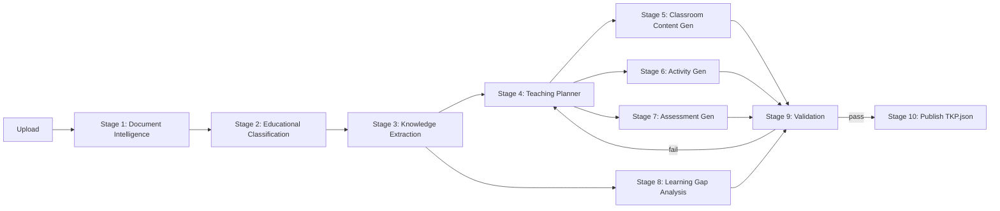

# Gyansetu TKP — Teacher Knowledge Package

> **Note:** This project was built for the GyanSetu/IIT Mandi AI Engineer
> Internship technical assessment. See [LICENSE](./LICENSE) — usage beyond
> evaluating this application requires the author's permission.

AI pipeline that turns educational documents (PDF/DOCX/PPTX) into a structured
`TeacherKnowledgePackage.json` plus exportable PDFs via a 10-stage LangGraph workflow.

> Full setup, architecture, and decision log are in this README (see sections below).
> Deployment notes live in `deployment.md` (gitignored; filled during the deploy phase).

## Pipeline



## Setup

```bash
uv sync --extra dev
cp .env.example .env   # then fill GEMINI_API_KEY, BACKEND_API_KEY, etc.
docker compose -f docker-compose.dev.yml up -d
uv run alembic upgrade head
# optional: uv run pre-commit install
```

### Makefile shortcuts

```bash
make sync          # uv sync --extra dev
make backend       # uvicorn on :8000
make frontend      # Streamlit
make test          # full pytest + coverage (≥80%)
make test-unit     # unit tests only (pre-commit speed)
make lint          # ruff
make typecheck     # mypy
make eval          # mocked golden-dataset evals → evals/reports/latest_*
make docker-build  # multi-stage backend image
```

On Windows without `make`, run the underlying `uv run …` commands from the Makefile.

### Run backend

```bash
uv run uvicorn backend.app.main:app --reload --port 8000
```

### Run frontend

```bash
uv run streamlit run frontend/streamlit_app.py
```

### Tests & evals

```bash
uv run pytest
uv run python evals/run_ragas_eval.py --mock   # CI-safe; no live LLM keys required
```

Faithfulness threshold: **≥ 0.85** (`FAITHFULNESS_THRESHOLD` / `settings.faithfulness_threshold`).
Kept at 0.85 after MiniLM migration — the live Period 3 hallucination scores ~0.80
under MiniLM and would auto-pass at 0.50 (see ISSUES.md).
Reports: `evals/reports/latest_report.json`, `evals/reports/latest_summary.md`.

## Orchestration

LangGraph carries a single `TKPState` through 10 typed nodes. Stage 9 validation can
route back to generation nodes with a bounded retry count. Stages 5–7 fan out per period;
Stage 8 runs in parallel with them (depends only on Stage 3).

## Design decisions

- **Decision:** local `all-MiniLM-L6-v2` embeddings (384-d) into pgvector / **Because:** Gemini Embedding free-tier daily/RPM caps were burning the demo; local MiniLM removes that dependency entirely and loads once at app startup.
- **Decision:** Flash-Lite primary → Groq fallback → full Flash last-resort / **Because:** Flash free-tier (20 RPD) was the binding constraint; Lite (~250K TPM) covers full-document extraction/planning with headroom, Groq absorbs overflow, Flash only if both fail.
- **Decision:** pgvector on Postgres / **Because:** one free resource instead of a separate vector DB.
- **Decision:** no Celery/Redis in v1 / **Because:** single-reviewer demo; asyncio + FastAPI background tasks suffice.
- **Decision:** hallucination check via embedding similarity + LLM judge; threshold stays **0.85** / **Because:** FAQ grounding rule — facts from source only; pedagogy may be general. Synthetic MiniLM bands suggested 0.50, but the real Period 3 "agents of gradation" case scores ~0.80 under MiniLM and would auto-pass at 0.50 without the judge.
- **Decision:** flexible period count / **Because:** FAQ Q3 — driven by content volume/complexity, not hardcoded 5×40.

## Eval thresholds

Minimum acceptable: faithfulness ≥ 0.85 (see `FAITHFULNESS_THRESHOLD`).

### Security audit notes

See **[SECURITY.md](SECURITY.md)** for the pip-audit CVE reachability analysis
(what is patched, what is installed-but-unreachable and why, and what would require
a major-version bump). Do not treat raw `pip-audit` exit codes as exploitability
without that document. Application controls: API key auth, CORS allowlist, upload
validation, rate limits, secret redaction, and `bandit` on `backend/app`.

Engineering issue log: **[ISSUES.md](ISSUES.md)**.
