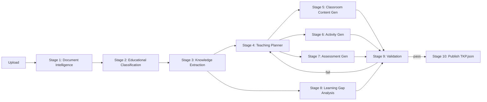

# Teacher Knowledge Package (TKP) — Build Plan
GyanSetu / IIT Mandi AI Engineer Assignment — Deadline: Aug 4, 2026, 11:59 PM IST

---

## 1. What's actually being built

A pipeline that takes a raw educational document (PDF/DOCX/PPTX) and produces a structured
`TeacherKnowledgePackage.json` through 10 stages, streamed to the user in real time, with a
simple UI to review the output.



Stages 5, 6, 7 fan out per-period (parallelizable in LangGraph) — this is where most of the
LLM call volume lives, so rate limits matter most here.

---

## 2. Tech stack decisions

| Layer | Choice | Reasoning |
|---|---|---|
| Backend | FastAPI | JD requirement. Matches PaperVault / Agentic Orchestration Engine. |
| Orchestration | LangGraph | Typed state per node, conditional edges for the Stage 9 → Stage 4/5 retry loop. |
| Primary LLM | Gemini 2.5/3 Flash (AI Studio, free) | 1M token context = whole chapter in one call for Stage 1-3. Multimodal — can read diagram/equation pages directly. ~1,500 req/day free. |
| Fallback LLM | Groq (Llama 3.3 70B / GPT-OSS 120B) | Very fast, absorbs overflow from the high-volume Stage 5-7 generation calls. Free, no card. |
| Optional 3rd option | OpenRouter | Mentioned explicitly in the FAQ doc; use if you want one gateway across multiple free models instead of managing two SDKs. |
| Structured output | Pydantic v2 models per stage | Doubles as your Stage 9 schema-validation layer. Same discipline as your RAGAS eval work. |
| Database | Neon Postgres (free, permanent) + pgvector extension | One free resource instead of two (no separate Qdrant account). Handles TKP storage (JSONB) and embeddings for hallucination checking / RAG bonus. |
| Queue | None for v1 (asyncio + FastAPI background tasks) | A single-reviewer demo doesn't need Celery/Redis. Add Redis only if you have slack time (bonus: "Performance Optimization"). |
| Progress API | SSE (`/stream/{job_id}`) | Same pattern as your Agentic Orchestration Engine's SSE streaming. |
| Frontend | Streamlit | Explicitly suggested by the assignment. Upload + live progress bar (consume SSE) + TKP viewer, in Python, fast to build. |
| Document parsing | PyMuPDF (text) + pdfplumber (tables) + Gemini multimodal (diagrams/equations/scanned) | Matches FAQ Q7's "classify document type → route to parser" guidance. No paid OCR service needed. |
| Testing | pytest + httpx AsyncClient | Same as PaperVault's ingestion/generation test suites. |
| Observability | Structured logging (`structlog` or stdlib JSON logs) per stage + retry counters | Cheap bonus points, low effort. |

### Deployment

| Component | Platform | Free tier notes (verified) |
|---|---|---|
| Backend (FastAPI+LangGraph) | Hugging Face Spaces, Docker SDK | Free CPU space, no card. **Only `/tmp` is writable** — don't rely on local disk for persistence. |
| Frontend | Streamlit Community Cloud | Free, 1GB RAM, sleeps after 12h idle, one-click GitHub deploy. |
| Database | Neon Postgres | Free forever, 0.5GB storage, 100 CU-hrs/month, pgvector supported. |
| LLM | Google AI Studio (Gemini) + Groq | Both free, no card required. |

**Key constraint to design around:** HF Spaces free tier wipes disk on restart. So: parse the
uploaded file immediately on request, discard the raw bytes, persist only extracted
text/metadata/generated TKP JSON to Neon. Don't try to serve the original PDF back later.

---

## 3. Repo structure

```
gyansetu-tkp/
├── backend/
│   ├── app/
│   │   ├── main.py                 # FastAPI app, routes
│   │   ├── graph/
│   │   │   ├── state.py            # LangGraph shared state (Pydantic)
│   │   │   ├── nodes/              # one file per stage (10 files)
│   │   │   └── build_graph.py      # wires nodes + conditional edges
│   │   ├── schemas/                # Pydantic models: TKP, LessonPeriod, Assessment, etc.
│   │   ├── parsing/                # pymupdf/pdfplumber/docx/pptx routers
│   │   ├── llm/                    # gemini_client.py, groq_client.py, retry/backoff wrapper
│   │   ├── db/                     # Neon connection, models, pgvector helpers
│   │   └── validation/             # schema check, grounding/hallucination check
│   ├── tests/
│   ├── Dockerfile
│   └── requirements.txt
├── frontend/
│   ├── streamlit_app.py
│   └── requirements.txt
├── samples/
│   ├── tkp_sample_stem.json
│   └── tkp_sample_humanities.json
├── README.md                       # setup, architecture diagram, orchestration explanation
└── .env.example
```

---

## 4. Core API surface

```
POST   /documents/upload          -> {job_id}
GET    /stream/{job_id}           -> SSE: {"stage": "...", "progress": 0-100}
GET    /jobs/{job_id}/tkp         -> TeacherKnowledgePackage.json
GET    /jobs/{job_id}/pdf/{doc}   -> generated Lesson Plan / Teacher Guide / Assessment PDF
POST   /documents/classify-hint   -> optional user-provided doc type (Q7 FAQ)
```

---

## 5. 4-day schedule

**Day 1 — Skeleton, deployed end-to-end**
- FastAPI + LangGraph graph with all 10 nodes stubbed (return dummy data matching schemas)
- SSE streaming wired, Streamlit hitting it
- Neon DB connected, HF Space + Streamlit Cloud both live with the stub pipeline
- Goal: a reviewer could click through the whole flow today, even with fake content

**Day 2 — Real Phase 1 (Stages 1-3)**
- Document classification hint UI (Q7: Mostly Text / Tables / Diagrams / Equations / Scanned)
- Real parsing router, Gemini-based extraction with Pydantic structured output
- Test against one real NCERT chapter (pick one STEM, keep a humanities one for Day 4 testing)

**Day 3 — Real Phase 2 (Stages 4-8)**
- Teaching Planner (flexible period count, per FAQ Q3 — don't hardcode 5×40)
- Per-period fan-out for content/activity/assessment generation (parallel LangGraph branches)
- Learning gap analysis

**Day 4 — Phase 3 + polish + submit**
- Stage 9 validation (schema check + grounding check against extracted knowledge, per FAQ Q4)
- Stage 10 publish (TKP.json + PDF exports via your existing pdf skill patterns)
- pytest suite, README with Mermaid diagram, 2 sample TKPs in `/samples`
- Test with the humanities chapter to confirm adaptability (25% "versatility" weight)
- Deploy sanity check, submit via the form with buffer before 11:59 PM on the 4th

---

## 6. Design decisions to state explicitly in your README (per the email's instructions)

- Why pgvector-on-Neon instead of a separate vector DB (fewer free resources to manage)
- Why Gemini as primary / Groq as fallback (context window vs. speed trade-off)
- Why no Celery/Redis in v1 (single-user demo scope, not a scale requirement)
- How "hallucination" is checked per FAQ Q4 (grounded to primary source; secondary knowledge
  allowed only for pedagogy — analogies, activities — never new facts)
- How period count/length is decided (FAQ Q3 — driven by content volume + complexity, not fixed)